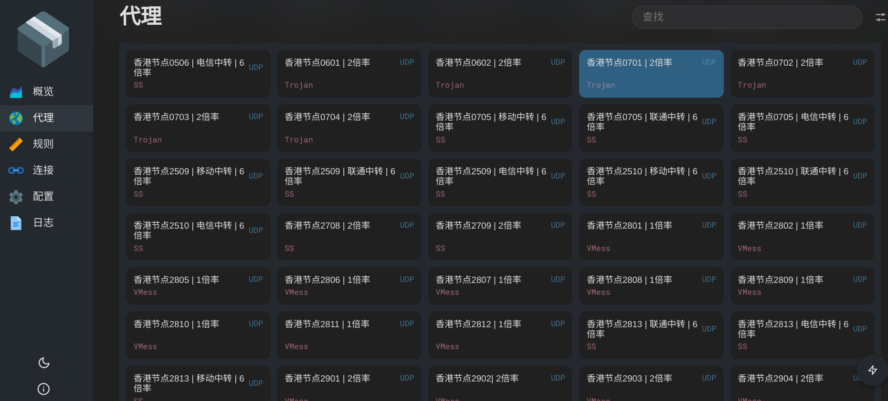

# 如何使用 HiddifyCli 或 Hiddify 命令行

HiddifyCli 是为没有图形界面的情况下（例如服务器）使用 Hiddify 开发的，并且支持所有处理器。

<!-- more -->

## 下载 HiddifyCli

要下载此应用程序，请转到[此处](https://github.com/hiddify/hiddify-core/releases)并下载与您的处理器相关的文件。

```bash

wget -O /tmp/hiddify-cli-linux-amd64.tar.gz https://ghfast.top/https://github.com/hiddify/hiddify-core/releases/download/v3.1.8/hiddify-cli-linux-amd64.tar.gz


sudo tar -xvzf /tmp/hiddify-cli-linux-amd64.tar.gz -C /usr/local/

```

## 启动 HiddifyCli

使用订阅 url 启动 Hiddify

> 先进行 [**订阅购买**](https://shortlink181.github.io/1) ，获取到订阅地址。订阅链接位于：仪表盘 > 一键订阅 , 然后复制订阅地址或者扫描二维码订阅。

```bash

sudo /usr/local/HiddifyCli run -c https://my.airports.top/api/v1/client/subscribe?token=xxxxxxxx

```

如果需要配置参数，可以直接从图形化的 HiddifyApp 上获取，获得方法为：HiddifyApp =》配置选项 =》点击右上角三个点按钮 =》将所有选项导出到剪贴板。

将其保存到一个文件中例如 exported-config.json, Hiddify 启动时可以使用这些选项

```bash
sudo /usr/local/HiddifyCli run -c https://my.airports.top/api/v1/client/subscribe?token=xxxxxxxx -d exported-config.json
```

如果你是使用订阅 url 启动 Hiddify， 那么 HiddifyCli 就会每次在当前目录生成一个名叫 current-config.json 的配置文件， 里面包含了所有节点信息。

当你再次启动，可以不必使用订阅 url（除非你需要刷新节点信息），可以直接使用配置文件启动 hiddify。

在配置文件中你也可以加入自己的节点， 非常得方便。

```bash

sudo /usr/local/HiddifyCli run -c current-config.json

```

启动成功后，控制台会输出如下信息，后面步骤会用到。

并确保端口开放，以便从服务器外部访问 Hiddify 管理界面。

```bash

pen http://localhost:6756/ui/?secret=K8WS6e31eSGXssd in your browser

```

## 管理和控制节点

在一台装有浏览器的机器打开上面的链接，将 localhost 替换为服务器的 ip 或域名

最后上一张管理界面截图如下：



可以进行节点测速，节点切换等操作。

## Trouble shooting

issue 1: 启动时出现如下报错

分析：

原因是：下载地址发生了变化，Hiddify cli 依赖 Yacd-meta 的 webui 用于管理节点和规则，这个 ui 并没有绑定在程序中，而且需要运行时下载。

解决办法： 手动下载[webui](https://codeload.github.com/MetaCubeX/Yacd-meta/zip/refs/heads/gh-pages), 放置在当前目录的 webui 文件夹，然后再次重启 HiddifyCli

```bash

ERROR clash-api: download external ui error: Get "https://github.com/MetaCubeX/Yacd-meta/archive/gh-pages.zip": exchange6: context canceled | exchange4: context canceled | upstream: context deadline exceeded


```
